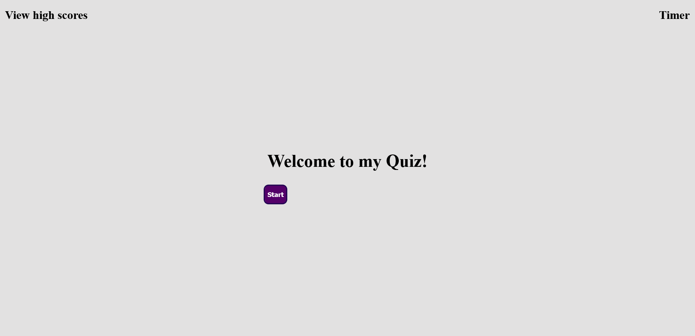

# Fourth Bootcamp Challenge: Code Quiz

##

## Description

Welcome to my fourth Coding Bootcamp Challenge! This one was real tough. It challenged me on another level and it's something I enjoyed.
For this week I created a coding quiz from scratch. It was built utilizing vanilla JavaScript and a lot of Google/Youtube. I referenced previous lessons and class activities continuously for this challenge. I find myself in constant need of a deeper understanding of JavaScript and this challenge is yet another stepping stone bringing me closer to the goal: becoming a fluent JavaScript Developer.

My motivation to complete this challenge comes from a desire to learn. With Coding in general we as developers are constantly learning. Not just the material but also ourselves and how we must teach ourselves.

This project is challenging me to understand concepts. It's giving me the ability to look at something abstract and translate it in a tangible way.

Coding Quiz stands out as a defiant challenger. It's not yet complete and I have a bit more to do before it'll become fully functional but I'll keep at it!

## Installation

N/A

## Usage

This application simply requires loading the browser and interacting with the on screen buttons.

## Credits

A HUGE shout out to Web Dev Simplified for his youtube video on [Building a Quiz App with JavaScript.](https://www.youtube.com/watch?v=riDzcEQbX6k&t=1332s)

Also, I'd like to thank [MDN.](https://developer.mozilla.org/en-US/docs/Web/JavaScript)
They're Docs are a true blessing for every developer and I'd be loss without them.
